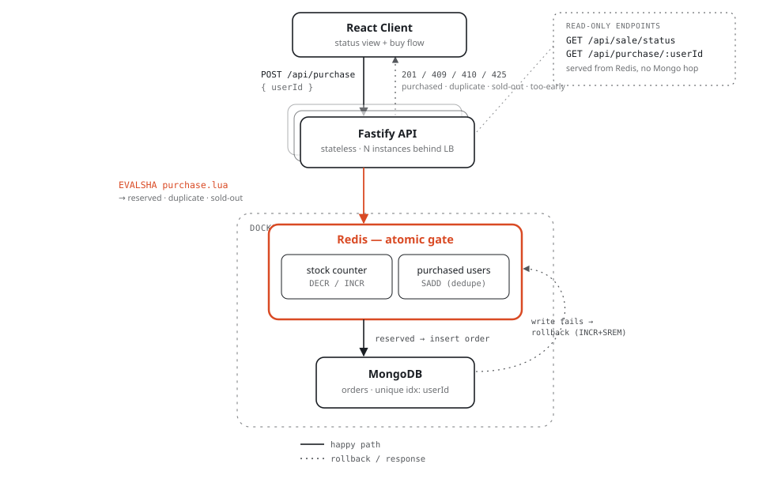

# Flash Sale System

A single-product, limited-stock flash sale backend + frontend built for the Bookipi
technical assessment: configurable sale window, strict one-item-per-user, and zero
overselling under heavy concurrent load.

**Stack:** Fastify + TypeScript · React + TypeScript (Vite) · MongoDB · Redis · Docker Compose

## Quick start

```bash
# 1. Start MongoDB + Redis
docker compose up -d

# 2. Backend API — http://localhost:4000
cd backend
cp .env.example .env
npm install
npm run dev

# 3. Frontend — http://localhost:5173 (in a second terminal)
cd frontend
npm install
npm run dev
```

Open http://localhost:5173, enter any user identifier, and click **Buy now**. The
sale defaults to 50 units and a 10-minute window starting immediately (edit
`backend/.env` to change `SALE_TOTAL_STOCK`, `SALE_START_AT`, `SALE_END_AT`).

To run the sale again from a clean slate without restarting anything:

```bash
cd backend && npm run seed:reset
```

> **No Docker available?** This project was actually developed and stress-tested on a
> machine without Docker installed. `mongodb-memory-server` (already a dependency) can
> boot a real `mongod` locally — see `backend/scripts/local-mongo.ts` — and a
> Homebrew-installed `redis-server` stands in for the Redis container. Both are
> functionally identical to the Docker services above; `docker-compose.yml` remains the
> intended way to run this.

## Architecture



The only step that has to be atomic is the stock check + per-user dedupe — that's the
actual race condition the brief is about. Everything else in the request path is
ordinary I/O around that one hop:

1. The client calls `POST /api/purchase`. The API is stateless, so any number of
   instances can run behind a load balancer without coordinating with each other.
2. The API delegates the check-and-decrement to a single Redis **Lua script**
   (`purchase.lua`), executed via `EVALSHA`. Because Redis executes commands (and Lua
   scripts) single-threaded, this is genuinely atomic — there is no window between
   "check the count" and "decrement it" for a second request to slip into. The script
   also checks a `purchased-users` Set in the same atomic step, so stock-limiting and
   one-per-user are enforced together, in one round trip, at Redis's normal latency.
3. Only a `reserved` result proceeds to persist a durable order in **MongoDB**, which
   also has a unique index on `userId` as a second, independent guard.
4. If the Mongo write fails for any reason, the API calls a second Lua script,
   `compensate.lua`, to roll the Redis counters back — so the two stores can never
   drift apart.
5. On boot, the API checks whether Redis already has a stock counter for this product
   (`SET ... NX`). If not — a fresh Redis, or one that lost its AOF file — it rebuilds
   the counter and the purchased-user set from MongoDB's actual order count before
   serving any traffic. If the counter is already there, boot leaves it completely
   alone. Mongo is the durable source of truth; Redis is a fast, disposable cache that
   can always be rebuilt from it, but **only when it's actually missing** — with
   several API instances behind a load balancer, unconditionally re-deriving the
   counter on every restart would let a newly-booting instance overwrite a live counter
   with a stale, too-high snapshot taken before other instances' concurrent sales,
   silently un-decrementing stock. A regression test
   (`tests/integration/api.test.ts` → *boot-time reconciliation safety*) reproduces
   exactly that scenario and asserts the live counter survives it untouched.

## Design choices & trade-offs

| Concern | Choice | Why |
|---|---|---|
| Concurrency gate | Redis + Lua (`EVALSHA`) | Single-threaded execution makes the check-and-decrement genuinely atomic — no lock, no compare-and-swap retry loop, sub-millisecond. |
| Source of truth | MongoDB, unique index on `userId` | Durable, queryable record of who actually won an item, and a second independent guard against duplicates. |
| Backend | Fastify + TypeScript | Schema-based serialization and low per-request overhead suit a "high-throughput" requirement, on the same Node/Express-family stack Bookipi uses. |
| Database | MongoDB | Matches the MERN stack (MongoDB + Express + React + Node) from Bookipi's own job posting — the design was tailored to the team, not written against a generic textbook choice. |
| Local infra | Docker Compose, real services | A reviewer runs `docker compose up` and gets the exact system described, not a simulation of Redis/Mongo behavior. |
| Failure handling | Compensating rollback (`INCR` + `SREM`) | If the Mongo insert fails after Redis already reserved the item, the API undoes the reservation so the counters stay truthful. |
| Startup recovery | Reconcile Redis from Mongo on boot | If Redis loses state (crash, fresh container), the API rebuilds it from Mongo before serving traffic, instead of quietly re-granting stock that was already sold. |
| Frontend | React + TypeScript (Vite) | Required stack; Vite keeps the dev loop fast for a time-boxed assessment. |

**What I'd change for a real production system, and didn't build here:** a message
queue (SQS/RabbitMQ) between the Redis reservation and the Mongo write so the HTTP
response doesn't wait on Mongo latency at all; Redis Cluster if a single sale ever
needed to exceed one Redis instance's throughput (unlikely for one product, but the
NFRs ask me to think about it — a single instance comfortably clears the ~4-7k req/s
this stress test drives, see below); and a proper admin API for configuring the sale
window instead of environment variables.

## API

| Method & path | Purpose |
|---|---|
| `GET /api/sale/status` | Sale status (`upcoming` / `active` / `ended`), remaining stock, window. |
| `POST /api/purchase` | Body `{ "userId": string }`. Attempts a purchase. |
| `GET /api/purchase/:userId` | Whether that user has already secured an item. |
| `GET /health` | Liveness/readiness for Redis + Mongo connectivity. |

`POST /api/purchase` outcomes:

| Outcome | HTTP status | Meaning |
|---|---|---|
| `purchased` | 201 | Reserved in Redis and durably recorded in Mongo. |
| `duplicate` | 409 | This user already has an order. |
| `sold_out` | 410 | No stock left. |
| `not_started` | 425 (Too Early) | Sale window hasn't opened yet. |
| `ended` | 410 (Gone) | Sale window has closed. |
| `error` | 503 | Transient failure; safe to retry (Redis was rolled back). |

## Testing

```bash
cd backend
npm test                # unit tests — pure logic, no external services
npm run test:integration  # integration tests — real Redis + an ephemeral in-memory Mongo
npm run test:all
```

Unit tests cover the sale-status time-window logic and the outcome→HTTP-status mapping.
Integration tests run the full Fastify app (via `.inject()`, no real socket) against a
real Redis instance and MongoDB, covering: status transitions across all three sale
phases, successful purchase, duplicate rejection, sold-out once stock hits zero, 425 on
an upcoming sale, 410 on an ended sale, and — critically — 30 concurrent purchase
requests against 3 units of stock, asserting exactly 3 succeed. `purchase.lua` is also
tested directly with 500 concurrent unique-user attempts against 20 units of stock, and
50 concurrent identical-user attempts, to isolate the atomicity guarantee from the rest
of the stack. All 28 tests pass.

## Stress test

```bash
# with the API running (npm run dev) and a freshly reset sale
cd backend
npm run seed:reset
npm run stress
```

`stress/stress-test.ts` hits a **running** server over real HTTP and proves the two
things that actually matter here, not just raw throughput:

1. A single user firing hundreds of concurrent requests at itself only ever wins once.
2. Thousands of unique concurrent users hitting a small pool of stock never oversells
   it — and MongoDB's own order count is cross-checked against Redis's counter
   independently, so a bug that let the two stores disagree would still be caught.

**Actual run** (300 units of stock, 300-way same-user race, then 3000 concurrent unique
buyers against the remaining stock):

```
Phase 1: 300 concurrent requests from the SAME user ("stress-race-...")
  outcomes: { purchased: 1, duplicate: 299 }

Phase 2: 3000 concurrent unique users vs 299 remaining stock...
  wall time:       0.43s (6934 req/s)
  latency ms:      min 128.6  mean 209.7  p50 212.0  p95 282.8  p99 302.8  max 421.0
  outcomes: { purchased: 299, sold_out: 2701 }

Sale after:  status=active remaining=0/300
Mongo order count for "flash-item-1": 300

Assertions:
  ✓ same user won exactly once under 300x concurrent self-race
  ✓ the other 299 concurrent requests from that user were all rejected as duplicates
  ✓ exactly the remaining stock (299) was sold in phase 2, not more
  ✓ no oversell: Redis remaining (0) + total sold (300) == totalStock
  ✓ Mongo order count (300) matches units sold (300)
  ✓ no request crashed the server (0 network errors)

PASS
```

300 sold out of exactly 300 stock, across 3300 concurrent attempts, on a single laptop
running the whole stack (API + Redis + Mongo) locally — at roughly 7,000 requests/sec.
The bottleneck in this design is intentionally the single Redis instance's command
throughput, not application logic or database locks, which is why the numbers stay
this clean under concurrency: there's no lock contention or retry storm to degrade, the
Lua script either finds stock or it doesn't, in one round trip.

## End-to-end verification

Beyond the automated suites above, the full flow was exercised manually against a live
stack: `docker`-free local Redis + Mongo → backend → frontend in an actual browser —
entering a user id, buying, seeing stock and the countdown update live, refreshing the
page and seeing "Already purchased" persist (backed by `GET /api/purchase/:userId`, not
just client state) — and via `curl` across all sale phases (upcoming/active/ended,
sold-out, duplicate, missing-body validation).

## Project structure

```
backend/
  src/
    lua/purchase.lua       # the atomic gate
    lua/compensate.lua     # rollback on Mongo write failure
    services/               # saleService, purchaseService
    routes/                 # sale, purchase, health
  tests/unit/ tests/integration/
  stress/stress-test.ts
frontend/
  src/App.tsx               # status view + buy flow
docker-compose.yml           # Redis + MongoDB
```
